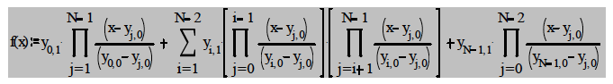

# **Polynomial Pattern Discovery** (CSCI334 Queens College, Fall 2021)

Given a set of pairs *`(Xi, Yi)`*, we can find a polynomial `f` such that  
&nbsp;&nbsp;&nbsp;&nbsp;&nbsp;&nbsp;&nbsp;&nbsp; `f(Xi) = Yi`  
This repo exhibits an implementation of finding such polynomial. Derivation is done using the formula found on page 50 of [Information-Statistical Data Mining: Warehouse Integration with Examples of Oracle
Basics, Bon K. Sy and Arjun K. Gupta](https://books.google.com/books?id=Qwo2mFAn7AEC&dq=bon+sy+data+mining&hl=en&sa=X&ei=hrU-VeuDGZX-yQT2y4HQDQ&ved=0CDEQ6AEwAA)  
  

Note:  
  
&nbsp;&nbsp;&nbsp;&nbsp;&nbsp;&nbsp;&nbsp;&nbsp;&nbsp;&nbsp;&nbsp;&nbsp;&nbsp;&nbsp;&nbsp;&nbsp;&nbsp;&nbsp;&nbsp;&nbsp;&nbsp;&nbsp;&nbsp;&nbsp;is represented by  

The equation above essentially has 3 terms and we label them as `h1`, `h2` and `h3`. We calculate them seperately and sum them up to get `f`

To run the program, you need to supply 4 arguments representing text files names at runtime.
1. args[0] has to be the name of a file with a header consisting of a number N representing the number of x1 f value pairs
followed by N lines with values space separated.
2. args[1] has to be the name of a file with a header consisting of a number N representing the number of x2 f value pairs.
3. args[2]: text file containing x1 values with missing y values
4. argv[3]: text file containing x2 values with missing y values

The program will generate 4 text files
1. g1.txt: text that contains information about the function g1 generated from args[0], 
2. g2.txt: text that contains information about the function g2 generated from args[1]
3. outY1.txt: text file containing y values corresponding to given x1 values
4. outY2.txt: text file containing y values corresponding to given x2 values

**Limitations**
* This program is not dynamic and only works for functions with one independent variable. 
* As a consequence of the above, the generalized function h(x1, x2) in two variables is not calculated.